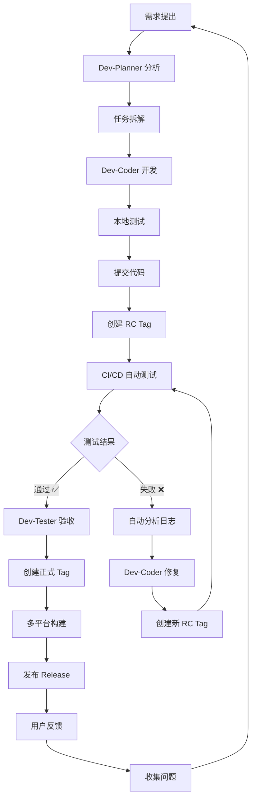

# XingJu v2.0 - 自动化软件开发流程

## 🎯 目标

建立一套**自我进化**的自动化开发流程，无需重复指导，自动执行最佳实践。

---

## 🔄 完整工作流



---

## 📋 阶段详解

### 阶段一：需求分析

**触发:** 用户提出需求

**自动化流程:**
1. Dev-Planner 分析需求
2. 拆解为可执行任务
3. 评估工作量
4. 创建任务清单

**输出:**
```markdown
## 需求分析

### 需求描述
____

### 任务拆解
- [ ] 任务 1: ____
- [ ] 任务 2: ____
- [ ] 任务 3: ____

### 工作量评估
- 开发：__ 小时
- 测试：__ 小时
- 总计：__ 小时

### 优先级
- P0: ____
- P1: ____
- P2: ____
```

---

### 阶段二：开发实施

**触发:** 任务清单确认

**自动化流程:**
1. Dev-Coder 领取任务
2. 创建功能分支：`feature/xxx`
3. 开发 + 本地测试
4. 提交代码审查

**开发规范:**
```bash
# 分支命名
feature/new-feature     # 新功能
bugfix/issue-123        # Bug 修复
hotfix/critical         # 紧急修复
refactor/module         # 重构

# 提交规范
feat: 新功能
fix: Bug 修复
docs: 文档更新
style: 代码格式
refactor: 重构
test: 测试
chore: 构建/工具
```

---

### 阶段三：代码审查

**触发:** Pull Request 创建

**自动化流程:**
1. 自动运行代码检查
2. 自动运行单元测试
3. Dev-Planner 审查代码
4. 批准后合并到 main

**检查清单:**
```markdown
## Code Review Checklist

### 代码质量
- [ ] 代码符合规范
- [ ] 无重复代码
- [ ] 命名清晰
- [ ] 注释充分

### 功能验证
- [ ] 功能完整实现
- [ ] 边界条件处理
- [ ] 错误处理完善
- [ ] 性能优化

### 测试覆盖
- [ ] 单元测试通过
- [ ] 集成测试通过
- [ ] 覆盖率达标 (>80%)
- [ ] 无已知 Bug
```

---

### 阶段四：RC 版本测试

**触发:** 代码合并到 main

**自动化流程:**
1. 自动创建 RC Tag: `vX.Y.Z-rc.N`
2. 触发简化版 CI/CD
3. Dev-Tester 验证
4. 生成测试报告

**CI/CD 测试 (简化版):**
```yaml
# .github/workflows/rc-test.yml
name: RC Test

on:
  push:
    tags:
      - 'v*-rc.*'

jobs:
  test:
    runs-on: ubuntu-22.04
    steps:
      - 依赖安装
      - Web 构建
      - Tauri 构建 (Linux)
      - 生成报告
```

**验收标准:**
- ✅ 所有构建阶段成功
- ✅ 产物可以下载
- ✅ 无严重错误
- ✅ 构建时间 < 45 分钟

---

### 阶段五：正式发布

**触发:** RC 测试通过

**自动化流程:**
1. 创建正式 Tag: `vX.Y.Z`
2. 触发完整版 CI/CD
3. 多平台构建
4. 自动创建 Release
5. 上传所有安装包

**CI/CD (完整版):**
```yaml
# .github/workflows/release.yml
name: Release

on:
  push:
    tags:
      - 'v*'

jobs:
  build-windows:
    # Windows 构建
  build-linux:
    # Linux 构建
  build-macos-intel:
    # macOS Intel 构建
  build-macos-arm:
    # macOS ARM 构建
  create-release:
    # 自动创建 Release
```

**产物:**
- Windows: MSI + NSIS
- Linux: DEB + AppImage
- macOS Intel: DMG
- macOS ARM: DMG

---

### 阶段六：发布后验证

**触发:** Release 创建

**自动化流程:**
1. 下载各平台安装包
2. 安装测试
3. 功能验证
4. 性能测试
5. 收集用户反馈

**验证清单:**
```markdown
## 发布验证

### 安装包测试
- [ ] Windows 安装成功
- [ ] Linux 安装成功
- [ ] macOS 安装成功

### 功能验证
- [ ] 核心功能正常
- [ ] 界面无异常
- [ ] 性能达标
- [ ] 无崩溃

### 用户反馈
- [ ] 收集反馈
- [ ] 整理问题
- [ ] 优先级排序
- [ ] 创建 Issue
```

---

### 阶段七：持续改进

**触发:** 用户反馈收集

**自动化流程:**
1. 分析用户反馈
2. 识别改进点
3. 创建优化任务
4. 进入下一轮迭代

**改进循环:**
```
用户反馈 → 问题分析 → 任务创建 → 开发 → 测试 → 发布 → 用户反馈
```

---

## 🤖 自动化脚本

### 1. 自动创建 RC 版本

```bash
#!/bin/bash
# scripts/create-rc.sh

# 获取下一个 RC 版本号
LAST_RC=$(git tag -l "v*-rc.*" | sort -V | tail -n1)
if [ -z "$LAST_RC" ]; then
  NEW_RC="v2.0.0-rc.1"
else
  # 提取版本号和 RC 号
  BASE_VERSION=$(echo $LAST_RC | sed 's/-rc\.[0-9]*$//')
  RC_NUM=$(echo $LAST_RC | grep -oP 'rc\.\K[0-9]+')
  NEW_RC_NUM=$((RC_NUM + 1))
  NEW_RC="${BASE_VERSION}-rc.${NEW_RC_NUM}"
fi

# 创建 RC Tag
git tag -a $NEW_RC -m "Release Candidate $NEW_RC"
git push origin $NEW_RC

echo "✅ Created RC version: $NEW_RC"
echo "📊 Monitor: https://github.com/xfengyin/XingJu/actions"
```

### 2. 自动分析构建失败

```bash
#!/bin/bash
# scripts/analyze-build-failure.sh

# 获取最新失败的构建
RUN_ID=$(gh run list --status failure --limit 1 --json databaseId --jq '.[0].databaseId')

# 下载日志
gh run download $RUN_ID --name logs

# 分析错误
echo "🔍 Analyzing build failure..."
grep -r "error:" logs/ | head -20

# 生成修复建议
echo ""
echo "💡 Suggested fixes:"
echo "1. Check dependency versions"
echo "2. Verify system packages"
echo "3. Review Rust/Node.js versions"
```

### 3. 自动发布流程

```bash
#!/bin/bash
# scripts/auto-release.sh

set -e

VERSION=$1

if [ -z "$VERSION" ]; then
  echo "❌ Usage: ./auto-release.sh vX.Y.Z"
  exit 1
fi

echo "🚀 Starting release process for $VERSION"

# 1. 创建正式 Tag
git tag -a $VERSION -m "Release $VERSION"
git push origin $VERSION

echo "✅ Tag created: $VERSION"

# 2. 等待构建完成
echo "⏳ Waiting for CI/CD to complete..."
# (可以使用 GitHub API 轮询状态)

# 3. 验证 Release
echo "📦 Verifying release..."
gh release view $VERSION

echo "✅ Release complete!"
echo "🔗 https://github.com/xfengyin/XingJu/releases/tag/$VERSION"
```

### 4. 自动版本升级

```bash
#!/bin/bash
# scripts/bump-version.sh

# 语义化版本升级
# ./bump-version.sh [major|minor|patch]

CURRENT_VERSION=$(git describe --tags --abbrev=0)
BUMP_TYPE=${1:-patch}

# 解析版本号
IFS='.' read -r MAJOR MINOR PATCH <<< "${CURRENT_VERSION#v}"

case $BUMP_TYPE in
  major)
    MAJOR=$((MAJOR + 1))
    MINOR=0
    PATCH=0
    ;;
  minor)
    MINOR=$((MINOR + 1))
    PATCH=0
    ;;
  patch)
    PATCH=$((PATCH + 1))
    ;;
esac

NEW_VERSION="v${MAJOR}.${MINOR}.${PATCH}"

echo "📈 Bumping version: $CURRENT_VERSION → $NEW_VERSION"

# 更新 package.json
jq --arg version "$NEW_VERSION" '.version = $version' package.json > tmp.json
mv tmp.json package.json

# 更新 tauri.conf.json
jq --arg version "$NEW_VERSION" '.package.version = $version' src-tauri/tauri.conf.json > tmp.json
mv tmp.json src-tauri/tauri.conf.json

git add package.json src-tauri/tauri.conf.json
git commit -m "chore: bump version to $NEW_VERSION"

echo "✅ Version bumped to $NEW_VERSION"
```

---

## 📊 角色职责矩阵

| 阶段 | Dev-Planner | Dev-Coder | Dev-Tester | Media-Creator |
|------|-------------|-----------|------------|---------------|
| **需求分析** | 主导 | 协助 | - | - |
| **开发实施** | 协调 | 主导 | - | - |
| **代码审查** | 主导 | 修改 | - | - |
| **RC 测试** | 协调 | 修复 | 主导 | - |
| **正式发布** | 主导 | 协助 | 验证 | 准备 |
| **发布验证** | 协调 | 修复 | 主导 | - |
| **持续改进** | 主导 | 实施 | 反馈 | 收集 |

---

## 🎯 自动化检查点

### 代码提交时

- [ ] 代码格式化
- [ ] 无 TypeScript 错误
- [ ] 单元测试通过
- [ ] 提交信息规范

### PR 创建时

- [ ] 自动 Code Review
- [ ] 自动运行测试
- [ ] 自动检查覆盖率
- [ ] 自动部署预览

### 合并到 main 时

- [ ] 自动创建 RC Tag
- [ ] 自动触发 CI/CD
- [ ] 自动通知 Dev-Tester

### RC 测试通过时

- [ ] 自动提示创建正式 Tag
- [ ] 自动准备 Release Notes
- [ ] 自动通知团队

### 正式发布时

- [ ] 自动多平台构建
- [ ] 自动创建 Release
- [ ] 自动上传产物
- [ ] 自动通知用户

---

## 📈 持续改进机制

### 每次发布后

1. **收集体会:**
   - 什么做得好？
   - 什么可以改进？
   - 遇到了什么问题？

2. **更新流程:**
   - 修订本文档
   - 更新自动化脚本
   - 优化 CI/CD 配置

3. **知识沉淀:**
   - 编写最佳实践
   - 记录踩坑经验
   - 更新检查清单

### 版本回顾模板

```markdown
## Release Retrospective - vX.Y.Z

### 做得好的
- ____
- ____

### 需要改进的
- ____
- ____

### 遇到的问题
- ____
- ____

### 改进行动
- [ ] ____
- [ ] ____
```

---

## 🔧 工具配置

### GitHub Actions

```yaml
# .github/workflows/auto-rc.yml
name: Auto RC Release

on:
  push:
    branches: [main]

jobs:
  create-rc:
    runs-on: ubuntu-22.04
    steps:
      - uses: actions/checkout@v4
      
      - name: Get last commit message
        id: commit
        run: echo "message=$(git log -1 --pretty=%s)" >> $GITHUB_OUTPUT
      
      - name: Check if should create RC
        if: contains(steps.commit.outputs.message, '[rc]')
        run: |
          ./scripts/create-rc.sh
```

### Git Hooks

```bash
# .git/hooks/pre-commit
#!/bin/bash

# 自动格式化
npm run format

# 运行类型检查
npm run type-check

# 运行单元测试
npm test
```

---

## 📚 相关文档

| 文档 | 用途 |
|------|------|
| DEVELOPMENT-WORKFLOW-v2.md | 开发流程详解 |
| CI-CD-TEST-TASK.md | CI/CD 测试任务 |
| RELEASE-CHECKLIST.md | 发布检查清单 |
| AUTOMATED-WORKFLOW.md | 本文档 - 自动化流程 |

---

## 🚀 快速开始

### 新功能开发

```bash
# 1. 创建功能分支
git checkout -b feature/new-feature

# 2. 开发 + 测试
# ... coding ...

# 3. 提交
git add .
git commit -m "feat: add new feature"
git push origin feature/new-feature

# 4. 创建 PR
# GitHub 网页操作

# 5. 等待审查 + 合并
```

### 发布新版本

```bash
# 1. 升级版本
./scripts/bump-version.sh minor

# 2. 创建 RC
./scripts/create-rc.sh

# 3. 等待测试通过
# 查看：https://github.com/xfengyin/XingJu/actions

# 4. 正式发布
./scripts/auto-release.sh v2.1.0
```

---

## 🎊 总结

**这套流程的特点:**

1. ✅ **自动化** - 尽可能自动化执行
2. ✅ **标准化** - 统一的流程和规范
3. ✅ **可追溯** - 每个阶段都有记录
4. ✅ **可进化** - 持续改进优化
5. ✅ **低干预** - 无需重复指导

**使用方式:**

按照流程执行，每次发布后回顾改进，让流程自我进化！

---

_创建日期：2026-03-12_  
_版本：v2.0_  
_状态：Ready to Use_
